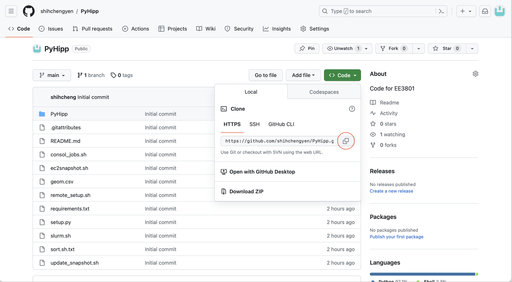
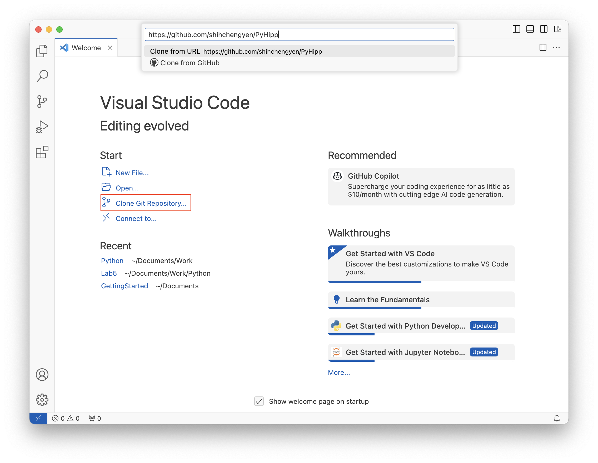
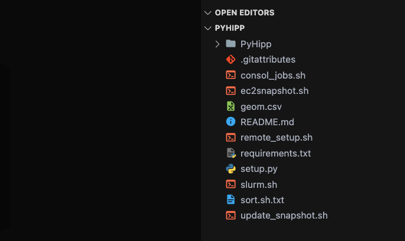
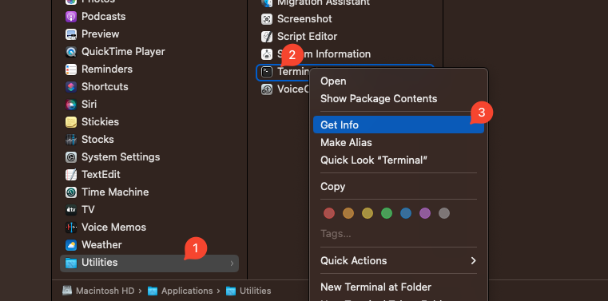
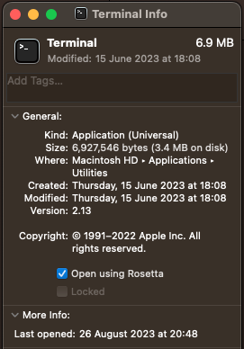
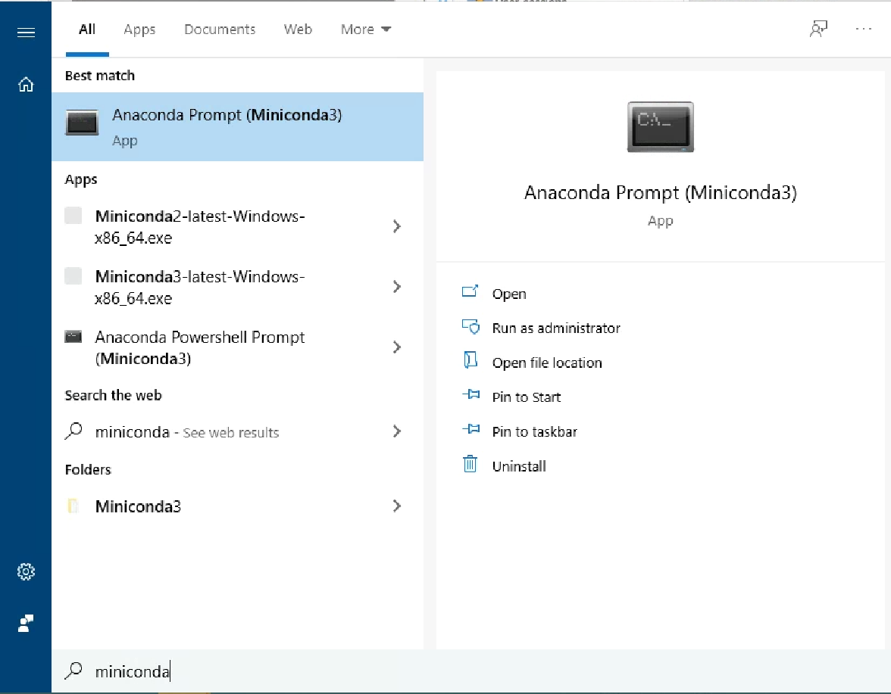
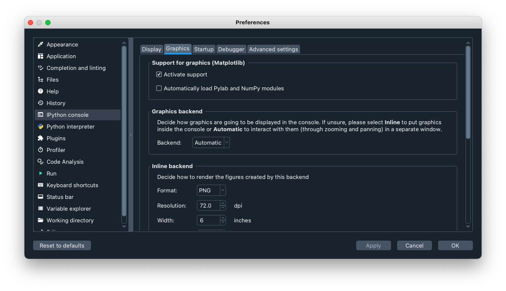
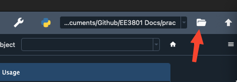
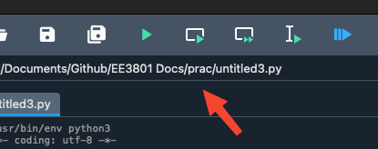
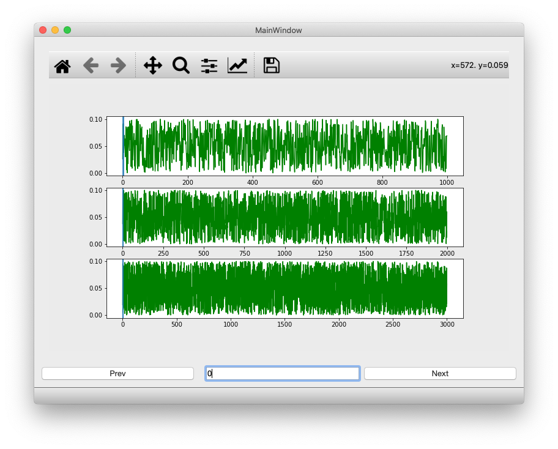

# Part 1. Install and test data analysis software

## 1.
Create a GitHub account [here](https://github.com) if you do not already have one.

## 2.
Fork the following [repository](https://github.com/shihchengyen/PyHipp) on GitHub, which you will be modifying in the next few weeks.

You can find instructions on how to fork a repository [here](https://guides.github.com/activities/forking/).

Once you have forked the repository, click on the Code button to reveal the link to your repository, and click on the "Copy Link" icon (highlighted in the red circle below).



## 3.
Install VS Code on your computer from [here](https://code.visualstudio.com).

After starting VS Code, select the "Clone Git Repository" option (highlighted in red below), which will create a text entry field in the title bar (as shown below). Paste the link to your repository there. You will then be asked to select a location on your computer (e.g. Documents/EE3801) to save the repository.



> <p class="note"> Note
> 
> We recommend that you create a folder that you will use for the rest of this course and clone all the necessary repositories inside it for ease of management. 
>
> **Avoid** folder names with space (eg. `Documents/EE3801 Lab Work`) unless you know what you are doing and are familiar with how path syntax works in command line interfaces (e.g. Terminal, PowerShell).

## 4.

Open up your VSCode with your PyHipp folder as the root folder.



Open up your VSCode terminal using `` Ctrl + ` ``. Type in the following command and you should see something as follow:

```bash
$ git remote -v

origin  https://github.com/shihchengyen/PyHipp.git (fetch)
origin  https://github.com/shihchengyen/PyHipp.git (push)
```

> <p class="note"> Note
>
> If your terminal does not return information as above, tried to do the following first:
> ```bash
> $ git remote remove origin
> $ git remote add origin https://github.com/shihchengyen/PyHipp.git
> $ git branch --set-upstream-to=origin/main main
> $ git remote -v
> ```
>
> If you get the same outcome as above, you can safely continue

What we would want to do is to set our `origin (fetch)` to `git@github.com:shihchengyen/PyHipp.git` while set your `origin (push)` to your forked respository `git@github.com:your-Github-username/PyHipp.git`.

This is because we would want to be able to pull any new update from the original PyHipp respository but any modification we made to our own repository should be pushed to our forked only and not modified the original respository (we also do not have right to push to the original repository anyway).

To achieve that, we do:

```bash
$ git remote set-url --add --push origin https://github.com/your-Github-username/PyHipp.git
```

Then once again, check that everything is set up correctly:

```bash
$ git remote -v

origin  https://github.com/shihchengyen/PyHipp.git (fetch)
origin  https://github.com/your-Github-username/PyHipp.git (push)
```

Now you can test if everything is working by typing:

```bash
$ git pull

Already up to date

$ git push

Everything up-to-date
```

## 5.
Next, assuming you have either Miniconda or Anaconda installed, use a Terminal window to create the “aws” conda environment with Python version 3.8.

> <p class="warn"> Warning
>
> *For MacOS M1 / M2 user, IMPORTANT*
>
> From this section onward, there are a few things that you need to make sure of:
> 1. Make sure your terminal is running on `arch = i386` or the Rosetta 2 translation layer for M1/M2. To do this, first open up your `Finder` -> `Applications`, right click on your choice of terminal. <br/>
> *\*in this example, `Terminal` was used, it is under the `Utilities` folder* <br/> 
> *\*if you are using other terminal applications, such as Alacritty, the process is the same* <br/>
>  <br/><br/>
> Then, you should see something like this <br/>
>  <br/>
> Select `Open using Rosetta`. Afterward, open up your terminal and type in this command `arch` and if you see `i386` you are good to go. 
> 2. Make sure you install the `Intel x86_64` (https://repo.anaconda.com/miniconda/Miniconda3-latest-MacOSX-x86_64.sh) version of Miniconda or Anaconda *NOT* the `Apple M1` version. This is because some packages rely on Cython to compile correctly to run (eg. pyedfread, ...), so the `Apple M1` version will not work (in general however, outside of this course, you should use the `Apple M1` version for best performance).
> 3. If you still have problems, please approach a GA for help to resolve your issue.

> <p class="note">Note
> 
> Windows users should enter the commands below using the Anaconda Prompt, which should have been installed when you install MiniConda or Anaconda.



```shell
(base) $ conda create -n aws python=3.8 -y

(base) $ conda activate aws

(aws) $ 
```

The symbols below

```shell
(base) $ 

(aws) $ 
```
indicates your command prompt, so you do not need to type them. In other words, when you see

```shell
(base) $ conda activate aws
```
only copy and paste the command:

```bash
conda activate aws
```

## 6.
Install software for reading the eye-tracker data files, which may require Administrator privileges:

> #### macOS:
> Install the Xcode command line tools:
>
> ```shell
> (aws) $ xcode-select --install
> ```
> Download the [Eyelink Installer](https://www.icloud.com/iclouddrive/06bafrFQFcoyve64IWZjMvjjw#EyelinkDisplayAPI_1.11.1).
>
> Right click and select “Open” from the drop-down menu in order to run the installer. Do not change the default installation location. After installation, check that the folder `/Applications/Eyelink` is present.

> #### Windows:
> Install [Visual Studio](https://visualstudio.microsoft.com/downloads) if it is not already installed.
> After that, use the Build tool to install “Desktop development with C++".
>
>Download and install the [Eyelink Installer](https://www.icloud.com/iclouddrive/03fVwOPcA9VK0RinNuC4DlhRA#EyeLinkDevKit_Windows_1.11). Make sure you choose the “C” drive for installation. After installation, check that the folder `C:\Program Files (x86)\SR Research\EyeLink\EDF_Access_API` is present.

> #### Linux
> Download the [Eyelink Installer](https://www.icloud.com/iclouddrive/0f6gouqAVEEuR7j4oMkZm8uOQ#eyelink-display-software_1).
> 
> Then run the following in your Terminal:
> ```shell
> (aws) $ tar -xvzf eyelink-display-software_1.11_x64_debs.tar.gz
> (aws) $ cd eyelink-display-software_1.11_x64
> (aws) $ sudo dpkg -i ./edfapi_4.0_amd64.deb
> ```

## 7.
Clone the following GitHub repositories onto your computer using VS Code (using the steps described in Steps 2 and 4) to a directory like `Documents/EE3801`:

- [Data Processing Tools](https://github.com/grero/DataProcessingTools)
- [PanGUI](https://github.com/grero/PanGUI)
- [pyedfread](https://github.com/nwilming/pyedfread)

You do not need to fork these repositories before cloning as you will not be modifying the code in these repositories.

## 8.
Python usually uses a "site-packages" directory to store all installed packages and libraries. So when you install a module, you will typically do "pip install .", which copies code to the site-packages directory (e.g. `~/anaconda3/envs/aws/lib/python3.8/site-packages/`). 
However, we will link the forked PyHipp repository on your computer to the site-packages directory instead by doing "pip install -e ." so that you can edit and test your code more quickly instead of having to install it into the site-packages directory each time you change some code (replace the directory path below with the appropriate directory for your computer):

```shell
(aws) $ cd ~/Documents/EE3801/DataProcessingTools

(aws) $ pip install -e .

(aws) $ cd ../PanGUI

(aws) $ pip install -e .

(aws) $ cd ../PyHipp

(aws) $ pip install -e .
```

> <p class="warn"> Warn
>
> Make sure that when you go up a directory with the command:
> ```shell
> (aws) $ cd ..
> ```
> your `PanGUI`, `PyHipp`, and `pyedfread` folder must exist in the same parent folder as your DataProcessingTools. In the example below, that would be the `Documents/EE3801` folder or else your command will fail.


## 9.
A number of these packages depend on other packages being installed, so we will need to install those pakages as well in the same `Documents/EE3801/PyHipp` folder:

```shell
(aws) $ pip install -r requirements.txt
```

## 10.
As the pyedfread module is from a third-party, and we are unlikely to modify it, we can just install it normally:

> <p class="note"> Note
> 
> Windows users need to switch to an Administrator user and edit the file edftypes.h (in C:\Program Files (x86)\SR Research\EyeLink\EDF_Access_API\Example) using VS Code, Notebook, or any other text editor, before running the command below. Replace Lines 15–25 with the following lines:
> ```bash
> #ifndef BYTEDEF
>	  #define BYTEDEF 1
>	  typedef unsigned char  byte;
>	  #ifndef _BASETSD_H_ /* windows header */
>		  typedef short          INT16;
>		  typedef int            INT32;
>		  typedef unsigned short UINT16;
>		  typedef unsigned int   UINT32;
>	  #endif
> #endif
> ```

```shell
(aws) $ cd ../pyedfread

(aws) $ pip install .

(aws) $ cd ..
```

> <p class="note"> Note
>
> You can also try installing by linking instead:
> ```shell
> (aws) $ pip install -e .
> ```

## 11.
If you installed Miniconda instead of Anaconda and have not installed Spyder, you will have to install Spyder using:

```shell
(aws) $ conda install spyder
```

> <p class="note"> Note
>
> If you get the following error:
>
> ```shell
> qtpy.QtModuleNotInstalledError: The QtWebEngineWidgets module was not found. It must be installed separately as PyQtWebEngine.
> ```
>
> you can do the following:
> ```shell
> (aws) $ conda install PyQtWebEngine
> ```

which should allow Spyder to work properly.

## 12.
Launch Spyder and test to make sure everything is installed and working properly:

```shell
(aws) $ cd

(aws) $ spyder
```

In the “iPython console” section under Preferences, choose the “Graphics” tab, and make sure the “Graphics backend” setting is set to “Automatic”:



> <p class="task"> Task
>
> Include a screenshot of the window in your lab report. 

To easily find and access all of your `.py` file created using Spyder, you can change your working directory of Spyder on the top right corner to your EE3801 lab directory.



Over here the path should be something like the following in your spyder:

`Users/user-name/Documents/EE3801/untitled.py`



*\*ignore the path in the image, it is just for illustration purposes*

Now, everytime you save the script, it will be saved to your working directory.

## 13.
Do the following to test the PyHipp and DataProcessingTools modules:

```shell
In[ ]: import PyHipp as pyh
In[ ]: pyh.pyhcheck('hello')
hello
```

Note that commands preceded by `In[ ]:` means you should be typing the commands in the Python console.

## 14.
Do the following to test the PanGUI module:

```shell
In[ ]: import PanGUI
In[ ]: PanGUI.test()
```

This should create a window that looks like the following:



> <p class="task"> Task
>
> Include a screenshot of the window in your lab report. 

After that, you can close the plot window.

## 15.
This brings you to the end of Part A. Submit your lab report and proceed to Part B. 

<!-- Test your pyedfread setup (replace the pyedfread directory below with the appropriate directory on your computer, and make sure you are NOT in the pyedfread directory when you perform the first command below):

```shell
In[ ]: from pyedfread import edf
In[ ]: cd ~/Documents/Python/pyedfread
In[ ]: samples, events, messages = edf.pread('SUB001.EDF')
In[ ]: events.shape
(485, 30)
```

> <p class="task"> Task
>
> Include a screenshot of the window in your lab report.  -->