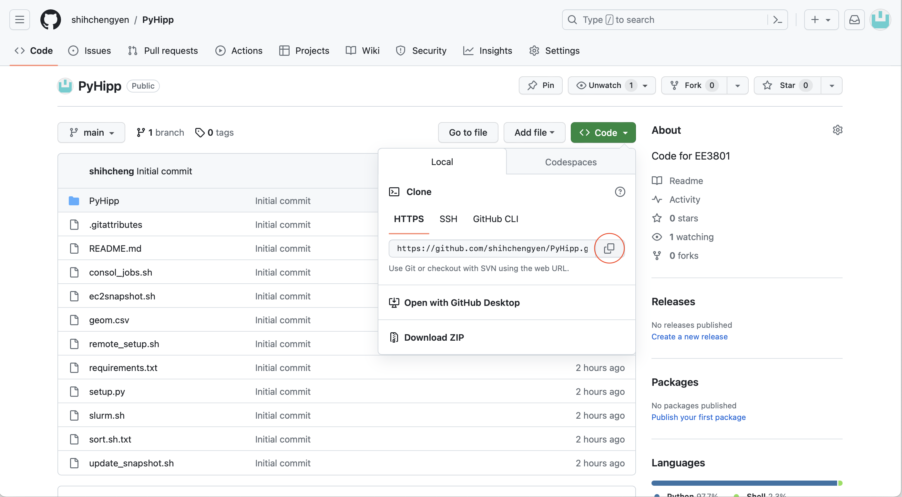
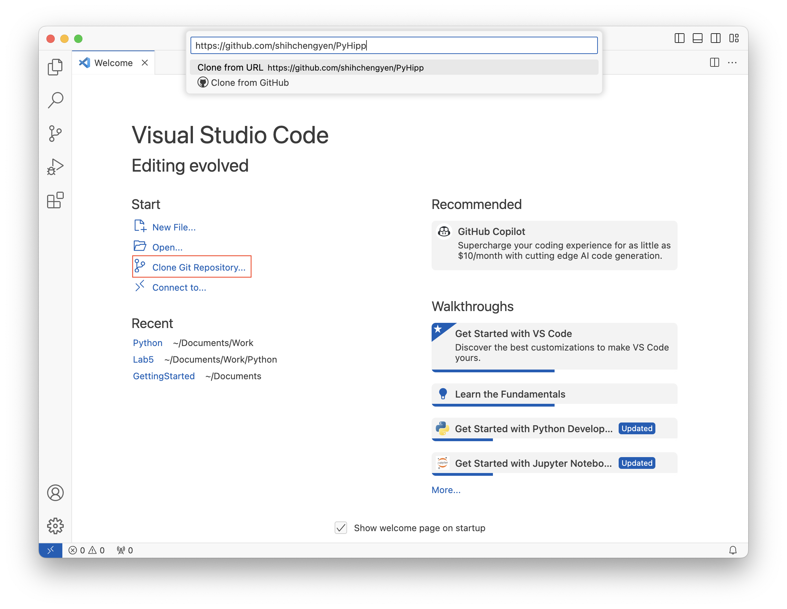
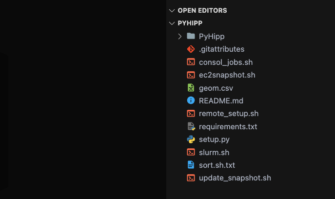
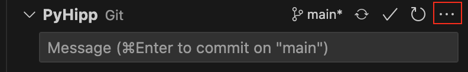
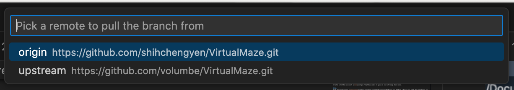
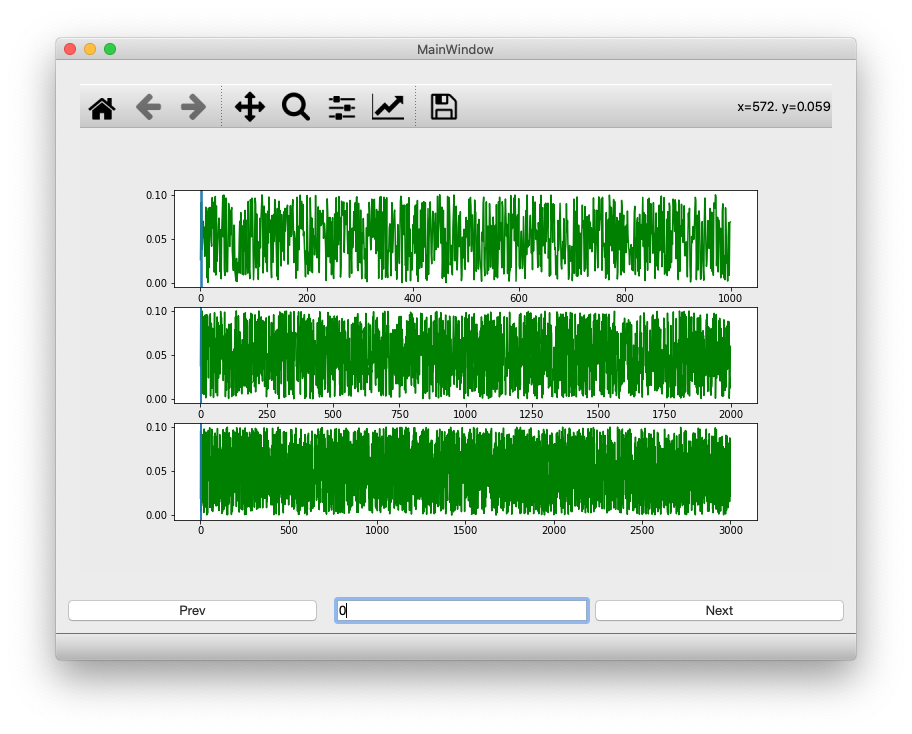

# Part 1. Install and test data analysis software

## 1.
Create a GitHub account [here](https://github.com) if you do not already have one.

## 2.
Fork the following [repository](https://github.com/shihchengyen/PyHipp) on GitHub, which you will be modifying in the next few weeks.

You can find instructions on how to fork a repository [here](https://guides.github.com/activities/forking/).

Once you have forked the repository, click on the Code button to reveal the link to your repository, and click on the "Copy Link" icon (highlighted in the red circle below).



## 3.
Install VS Code on your computer from [here](https://code.visualstudio.com).

After starting VS Code, select the "Clone Git Repository" option (highlighted in red below), which will create a text entry field in the title bar (as shown below). Paste the link to your repository there. You will then be asked to select a location on your computer (e.g. Documents/EE3801) to save the repository.



> <p class="note"> Note
> 
> We recommend that you create a folder that you will use for the rest of this course and clone all the necessary repositories inside it for ease of management. 
>
> **Avoid** folder names with space (eg. `Documents/EE3801 Lab Work`) unless you know what you are doing and are familiar with how path syntax works in the shell.

## 4.

Open up your VSCode with your PyHipp folder as the root folder.



Open up your VSCode terminal using `` Ctrl + ` ``. Type in the following command and you should see something like:

```bash
$ git remote -v

origin  https://github.com/yourname/PyHipp.git (fetch)
origin  https://github.com/yourname/PyHipp.git (push)
upstream  https://github.com/shihchengyen/PyHipp.git (fetch)
upstream  https://github.com/shihchengyen/PyHipp.git (push)
```

> <p class="note"> Note
>
> If your terminal does not return the information as above, try to do the following:
> ```bash
> $ git remote add upstream https://github.com/shihchengyen/PyHipp.git
> $ git remote -v
> ```
>
> If you get the same outcome as above, you can safely continue

> <p class="task"> Task
>
> Include a screenshot of the output of the git remote command in your lab report. 


Now you can test if everything is working by typing:

```bash
$ git pull

Already up to date

$ git push

Everything up-to-date
```

In the future, if you need to update code from the upstream repository, you can click on Source Control in the left sidebar, and click on the “…” button on the right side of the repository (highlighted in the red box below):



Select "Pull, Push"->"Pull from …", which will show something like this in the Command Palette (taken from another repository):



You can select the upstream PyHipp repository to pull in updates and then push the changes to your origin repository (your forked version).

## 5.
Clone the following GitHub repositories onto your computer using VS Code (using the steps described in Steps 2 and 4) to a directory like `Documents/EE3801`:

- [Data Processing Tools](https://github.com/grero/DataProcessingTools)
- [PanGUI](https://github.com/grero/PanGUI)

You do not need to fork these repositories before cloning as you will not be modifying the code in these repositories.

## 6.
If you do not have a version of conda installed, install it by following the instructions at:

<https://conda-forge.org/download/>

> <p class="note">Note
> 
> Windows users should use the Linux installer to install conda in WSL.

## 7.

Use a new Terminal window to create an “aws” conda environment with Python version 3.12:

```shell
(base) $ conda create -n aws python=3.12 -y

(base) $ conda activate aws

(aws) $ 
```
> <p class="note">Note
> 
> Windows users can either: 
>1) select "Ubuntu" from the Start menu; 
>2) select "Windows Terminal" from the Start menu, click the dropdown arrow next to the "+" (New Tab) button at the top of the window, and select Ubuntu; or 
>3) open a PowerShell or CMD window, and type wsl.

The symbols below

```shell
(base) $ 

(aws) $ 
```
indicates your command prompt, so you do not need to type them. In other words, when you see

```shell
(base) $ conda activate aws
```
only copy and paste the command:

```bash
conda activate aws
```

## 8.
Python usually uses a "site-packages" directory to store all installed packages and libraries. So when you install a module, you will typically do "pip install .", which copies code to the site-packages directory (e.g. `~/miniforge3/envs/aws/lib/python3.12/site-packages/`). 
However, we will link the forked PyHipp repository on your computer to the site-packages directory instead by doing "pip install -e ." so that you can edit and test your code more quickly instead of having to install it into the site-packages directory each time you change some code (replace the directory path below with the appropriate directory for your computer):

```shell
(aws) $ cd ~/Documents/EE3801/DataProcessingTools

(aws) $ pip install -e .

(aws) $ cd ../PanGUI

(aws) $ pip install -e .

(aws) $ cd ../PyHipp

(aws) $ pip install -e .
```

> <p class="note"> Note
>
> Make sure that when you go up a directory with the command:
> ```shell
> (aws) $ cd ..
> ```
> your `PanGUI` and `PyHipp` folders must exist in the same parent folder as your DataProcessingTools. In the example below, that would be the `Documents/EE3801` folder or else your command will fail.

> <p class="note"> Note 
>
>You can type part of the command, e.g. 
>
> ```shell
> cd ~/Doc
> ```
>
> and then hit the "Tab" key, where auto-complete will type the rest of "Documents" if it is the only directory or file with those first few letters.

## 9.
A number of these packages depend on other packages being installed, so we will need to install those pakages as well in the same `Documents/EE3801/PyHipp` folder:

```shell
(aws) $ pip install -r requirements.txt
```

## 10.
You are now ready to run the Python packages you installed using ipython:
```shell
(aws) $ ipython
```

which should give you the following prompt:
```shell
In[ ]: 
```

Do the following to test the PyHipp and DataProcessingTools modules:

```shell
In[ ]: import PyHipp as pyh
```

You may receive the following warning, but it is safe to ignore it:

```shell
/Users/shihcheng/Documents/Work/Python/PyHipp/PyHipp/eyelink.py:5: UserWarning: Eyelink import failed. You won't be able to read edf files
  warnings.warn("Eyelink import failed. You won't be able to read edf files")
```

Note that commands preceded by `In[ ]:` means you should be typing the commands in the ipython terminal.

You can test that PyHipp was installed properly by doing the following:

```shell
In[ ]: pyh.pyhcheck('hello')
```

which should return:

```shell
hello
```
This means that PyHipp has been installed successfully.

## 11.
Do the following to test the PanGUI module:

```shell
In[ ]: import PanGUI
In[ ]: PanGUI.test()
```

This should create a window that looks like the following:



> <p class="task"> Task
>
> Include a screenshot of the window in your lab report. 

After that, you can close the plot window.

## 12.
This brings you to the end of Part A. You can leave your ipython window running while you submit your lab report before proceeding to Part B. 

<!-- Test your pyedfread setup (replace the pyedfread directory below with the appropriate directory on your computer, and make sure you are NOT in the pyedfread directory when you perform the first command below):

```shell
In[ ]: from pyedfread import edf
In[ ]: cd ~/Documents/Python/pyedfread
In[ ]: samples, events, messages = edf.pread('SUB001.EDF')
In[ ]: events.shape
(485, 30)
```

> <p class="task"> Task
>
> Include a screenshot of the window in your lab report.  -->