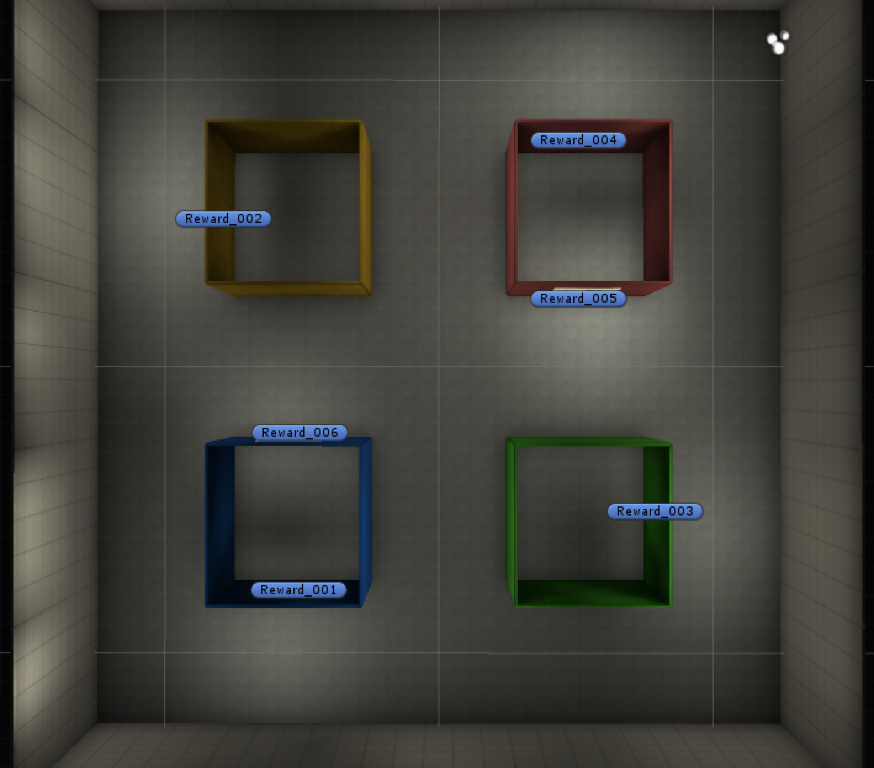
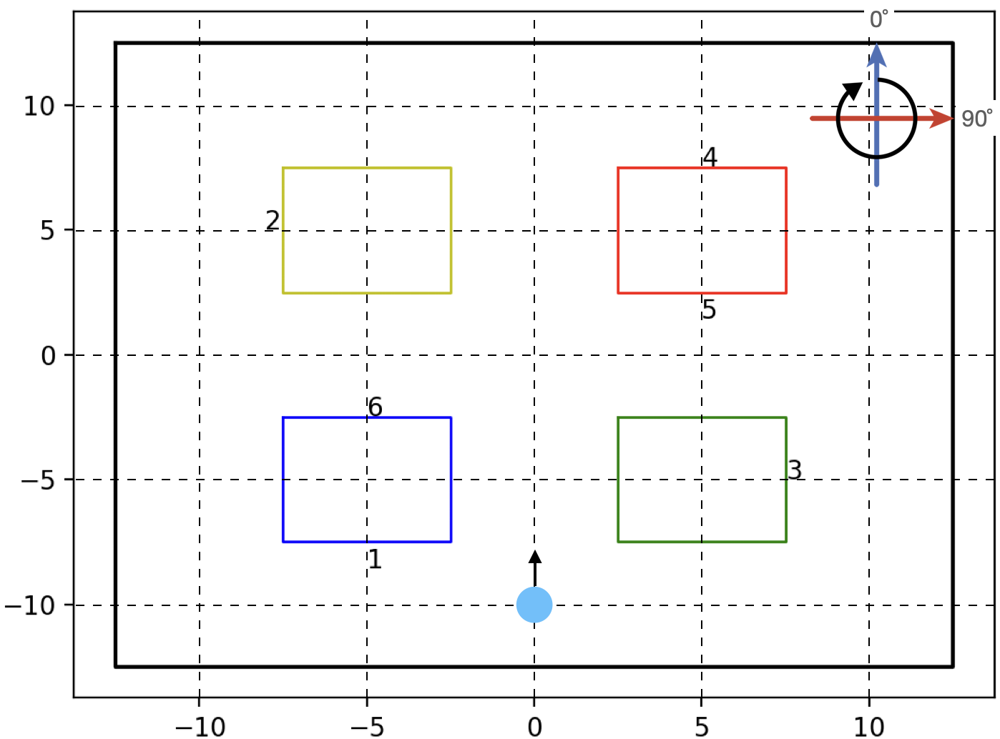
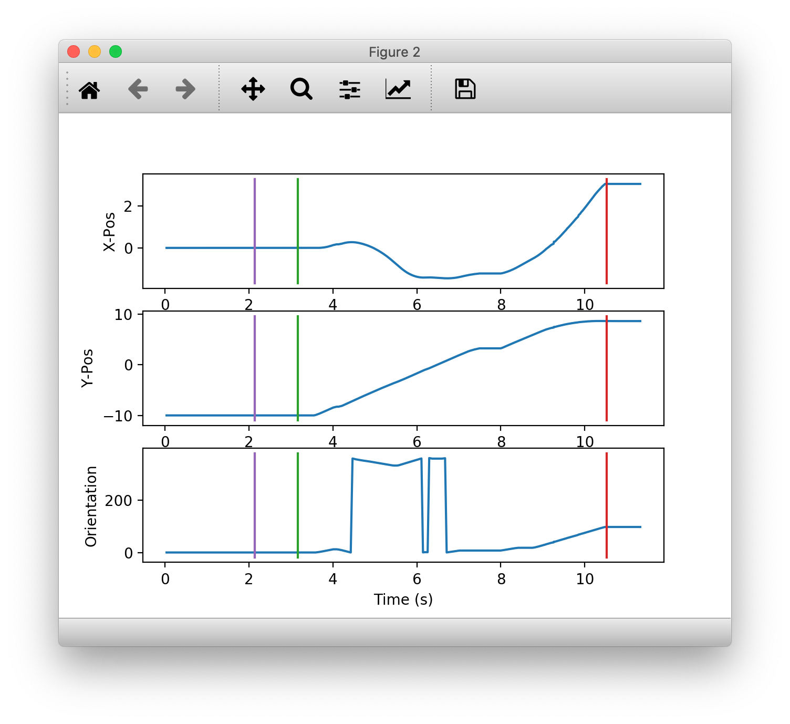
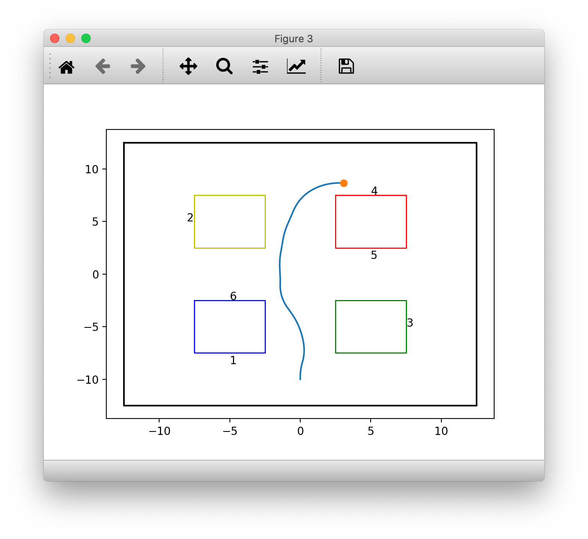

# Part 2

## 16.
First, create a folder named “picasso” on your laptop `~/Documents/EE3801/picasso`.

## 17.
Download the data (total size will be approximately 835 MB) from [here](https://cortex.nus.edu.sg:8399/sharing/8exIZsjCC) and unzip the files in the ZIP archive into the “picasso” folder.

## 18.
Using a new Terminal window (or Anaconda Prompt for Windows users), check that the data was downloaded and unzipped successfully:

```shell
(base) 
$ cd ~/Documents/EE3801/picasso

(base) 
$ ls -Rl

total 1629536
drwxrwxrwx  1 shihcheng  staff        264 Sep 19 21:50 20181105

./20181105:
total 464848
-rwxrwxrwx  1 shihcheng  staff  238001804 Sep 19 21:50 181105.edf
drwxrwxrwx  1 shihcheng  staff        264 Sep 19 21:50 session01

./20181105/session01:
total 2629560
-rwxrwxrwx  1 shihcheng  staff  686804912 Sep 19 21:50 181105_Block1.nev
drwxrwxrwx  1 shihcheng  staff        264 Aug  3  2020 RawData_T1-400
-rwxrwxrwx  1 shihcheng  staff  659528544 Sep 19 21:50 data_raw6.hkl

./20181105/session01/RawData_T1-400:
total 10360
-rwxrwxrwx  1 shihcheng  staff  5304189 Sep 19 21:50 session_1_5112018105323.txt
```

## 19.
You can now delete the ZIP archive.

## 20.
We are now ready to look at the data files from the experiment, which we discussed in the lecture. We will first read the files created by Unity that records the position of the animal in the maze. 

First, in Spyder, change directory to where you saved the data: 
```shell
In[ ]: cd ~/Documents/picasso/20181105/session01/
```

## 21.
The data file `session_1_xxxx.txt` is saved in a directory named `RawData_T1-400`. You can open it up in a text editor to see what it contains.

```shell
In[ ]: cat ./path/to/file
```

The first few lines record information about the version number of the data file (which allows you to track changes in the format of the file), the task that was used (in this case the Taxi Continuous Version 4), and other information about the experimental task. Line 15 is the start of the data sampled at about 30 Hz. 

The first column records the markers that denote either the start of the session (84), the Cue Onset (`1x` where x is a number between 1 and 6 depending on which poster was the destination for that trial, e.g. Line 65), the Cue Offset (`2x`, e.g. Line 89), or the end of the trial, which can be either Reward (`3x`, e.g. Line 290) or Timeout (`4x`, e.g. Line 30,114). 

The second column is the time elapsed since the last data point in seconds. 

The third column is the x-position in the maze (a top view of the maze is shown in the figure on the left below)

The fourth column is the y-position in the maze, with `(0,0)` being in the center of the maze (as shown in the figure on the right below). 



The last column is the orientation that the animal is facing in the maze, with the orientations indicated in the figure below. The cyan dot in the figure indicates the first position and orientation from the data file (Line 15: `x=0, y=-10, orientation = 0˚`).



## 22.
You can read the data (starting from Line 15) into Spyder using the following commands, which should be entered without line breaks (this might take a few minutes):

```shell
In[ ]: cd RawData_T1-400
In[ ]: import numpy as np
In[ ]: data = np.loadtxt("session_1_5112018105323.txt", skiprows=14)
```

## 23.
We will create a variable containing indices that will allow us to extract the first 300 points easily:

```shell
In[ ]: uind = np.arange(300)
```

## 24.
We will then create a time vector that we can use to plot the data by computing the cumulative sum of the timestamps in the second column of data:

```shell
In[ ]: ut = np.cumsum(data[uind,1])
```

## 25.
We are now ready to plot out the data. We will first import matplotlib:

```shell
In[ ]: import matplotlib.pyplot as plt
```

## 26.
We will create a figure with three subplots, showing the `x-position`, `y-position`, and `orientation` as a function of time. It might be easier for you to copy and paste the following into the editor window in Spyder, select the code, right-click, and select the “Run selection or current line” command:

```python
plt.figure()
plt.subplot(3,1,1)
plt.plot(ut,data[uind,2])
plt.xlabel('Time (s)')
plt.ylabel('X-Pos')
mi = data[uind,0].nonzero()
yl = plt.ylim()
t2 = ut[mi[0][1:]]
pt2 = np.kron(np.ones((2,1)),t2)
py2 = np.kron(np.ones((np.size(pt2,1),1)),yl).transpose()
plt.plot(pt2,py2)

plt.subplot(3,1,2)
plt.plot(ut,data[uind,3])
plt.xlabel('Time (s)')
plt.ylabel('Y-Pos')
yl = plt.ylim()
py2 = np.kron(np.ones((np.size(pt2,1),1)),yl).transpose()
plt.plot(pt2,py2)

plt.subplot(3,1,3)
plt.plot(ut,data[uind,4])
plt.xlabel('Time (s)')
plt.ylabel('Orientation')
yl = plt.ylim()
py2 = np.kron(np.ones((np.size(pt2,1),1)),yl).transpose()
plt.plot(pt2,py2)
```

Note that since the plot function can plot multiple lines at the same time, we created the matrices `pt2` and `py2` so we can draw all the markers with a single call to the plot function instead of using a for-loop to plot one line at a time. This is a vectorization approach that we will revisit throughout the labs, and can be very useful in processing data.

> <p class="task"> Task
>
> Include the figure produced by the code above in your lab report.



## 27.
A better way to view the position data is to create a 2D plot (like the one shown below), which you should do now. But before plotting the `x`,`y` positions of the animal, we should also show the boundaries of the maze (at -12.5 to 12.5 in both x- and y-directions), as well as the pillars (at ±2.5 and ±7.5) inside the maze. Add a different marker to the last point so it is clear which is the destination. Also add text labels to mark the locations of the posters (at ±2.5, ±5, and ±7.5). 

> <p class="task"> Task
>
> Include the Python script and the figure it produced in your lab report.

