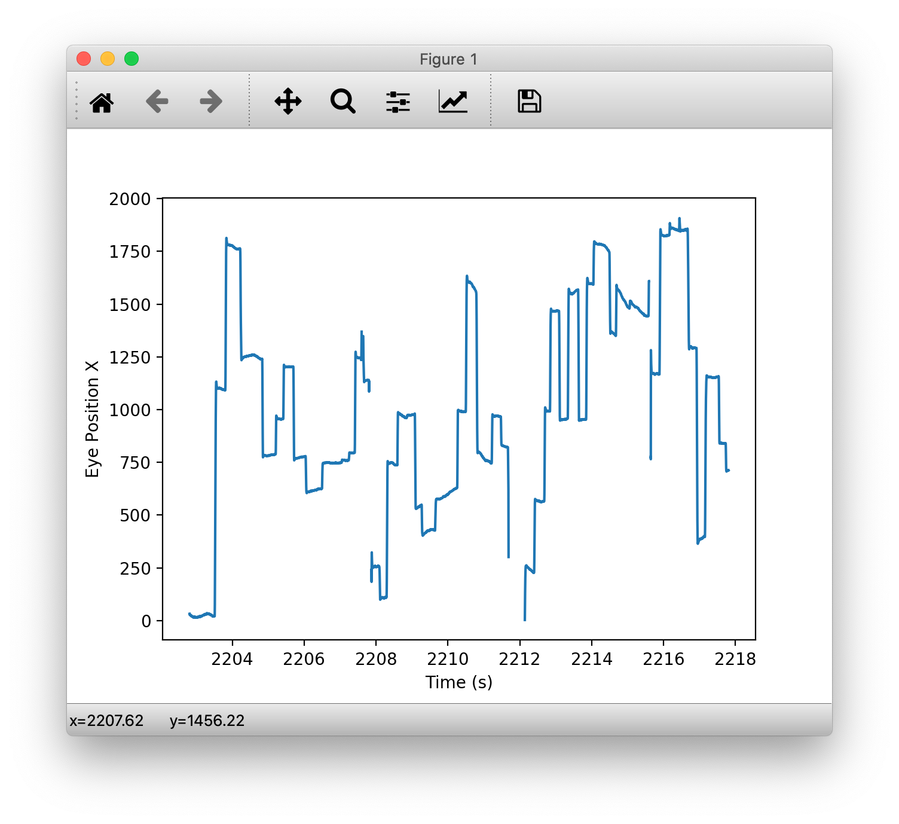
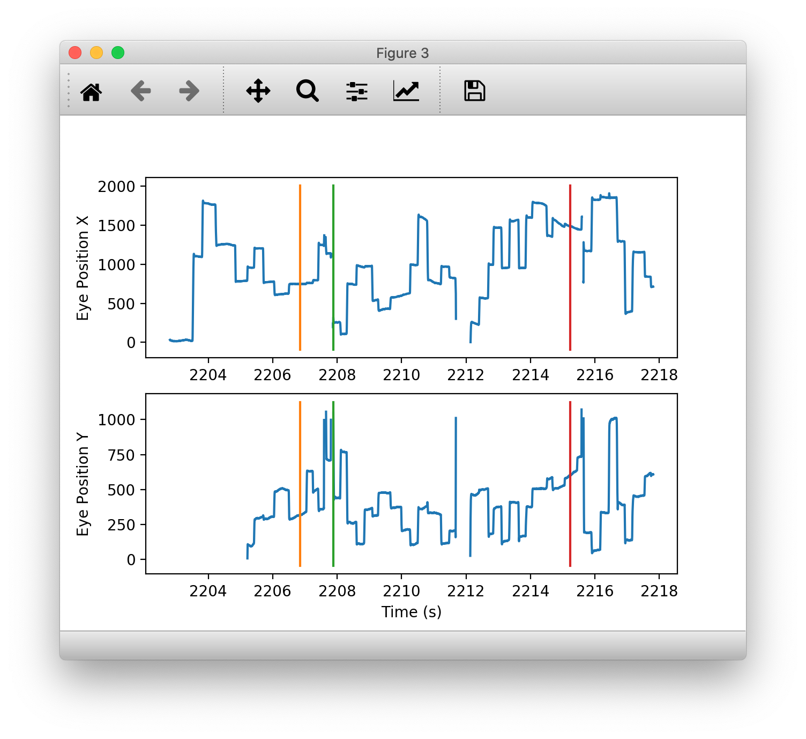

# Part 3. Working with eye-tracking data

## 28.
We will now look at the eye-tracking data produced by the Eyelink eye-tracker. 
Change directory to the day directory `20181105`:
```shell
In[ ]: cd ../..
```

## 29.
<!-- The data is stored in EDF files, which are binary files that we will need to use the pyedfread package to read (this might take a few minutes):

```shell
In[ ]: samples, events, messages = edf.pread('181105.edf', trial_marker=b'Start Trial')
```
 -->
 
 The data is normally stored in EDF files, which are binary files that we will need to use the pyedfread package to read. But since it might take a while, you can download the data from Canvas: Files->Part 2 YSC->eyedata.zip

Once you have unzipped the files, you should be able to do:

```shell
In[ ]: import pandas as pd
In[ ]: samples = pd.read_pickle('samples.pkl')
In[ ]: events = pd.read_pickle('events.pkl')
In[ ]: messages = pd.read_pickle('messages.pkl')
```
 
## 30.
The three variables are `DataFrames`, with samples containing the raw information about the eye at the sampling rate of the eye-tracker. You can see the column names by doing:

```shell
In[ ]: samples.columns
```

The relevant column names are: `gx_left` and `gy_left` for x- and y-positions of the gaze, ”time” for the sample number associated with each data point (you will need to divide by the sampling rate to get time in seconds). You can take a look at the data by doing:

```shell
In[ ]: samples[['time','gx_left','gy_left']][0:9]
```

## 31.

The events DataFrame contains information about fixations and saccades, with the relevant column names being: “type”, “start”, and “end” indicating the type of eye movement, and the sample number for the start and end of each eye movement, respectively. 

```shell
In[ ]: events[['type','start','end']][0:9]
```

## 32.
The messages `DataFrame` contains the markers sent by the Unity program, with the relevant column names being: `trialid_time`, `Cue_time`, and `End_time`, representing the Cue Onset, Cue Offset, and the end of the trial, respectively. Like the data in samples and events, these values actually represent sample number, not time, so you will have to divide by the sampling rate to get time in seconds.

```shell
In[ ]: messages
```

## 33.
We will first convert the relevant data from sample numbers to timestamps using the sampling rate of 1,000 samples per second:

```python
esr = 1000
samples['time'] = samples['time']/esr
events[['start','end']] = events[['start','end']]/esr
messages = messages/esr
```

## 34.
We can write a script to extract the first 15000 points in samples to plot by doing:

```python
eind = np.arange(15000)
ex = samples['gx_left'][eind]
et = samples['time'][eind]
plt.figure()
plt.plot(et,ex)
plt.xlabel('Time (s)')
plt.ylabel('Eye Position X')
```

## 35.
You will notice that the range of the data is very large because sometimes the eye position of the subject exceeds the limits of the monitor, which had a resolution of 1920 x 1080. So we will remove points outside the range of the monitor by doing:

```python
ex[ex>1920] = np.nan
ex[ex<0] = np.nan
```

## 36.
We can now replot by doing:

```python
ax = plt.gca()
ax.clear()
plt.plot(et,ex)
plt.xlabel('Time (s)')
plt.ylabel('Eye Position X')
```

which should give you the figure below:



The eye position stays at one point for a brief period of time (average duration of 300 ms) before rapidly moving to another point. The periods of stability are called fixations, while the rapid eye movements are called saccades.


## 37.
You can now add plots of the first event by doing:

```python
yl = plt.ylim()
xval = events['start'][0]
plt.plot([xval,xval],yl)
xval = events['end'][0]
plt.plot([xval,xval],yl)
```

Click on the magnifying glass icon to zoom in on the data right around the two vertical lines that were just created. This will show that the start of the first event, which was a fixation, started fairly close to the beginning of the data, and ended just as the x-position started changing.

## 38.
You can plot the start and end of the second event, which was a saccade, by doing:

```python
xval = events['start'][1]
plt.plot([xval,xval],yl)
xval = events['end'][1]
plt.plot([xval,xval],yl)
```

## 39.
You can see that the second event, which was a saccade, starts right after the fixation ended, and ended right before the x-position stopped changing. This shows that the variable events can be used to identify different types of eye movements, which will come in handy in a later lab.

## 40.
Now we will turn to the markers. You can add markers one-by-one to your plot by doing:

```python
xval = messages['trialid_time'][0]
plt.plot([xval,xval],yl)
xval = messages['Cue_time'][0]
plt.plot([xval,xval],yl)
xval = messages['End_time'][0]
plt.plot([xval,xval],yl)
```

You can click on the home icon to zoom out so you can see the additional three vertical lines added. Note that we are starting from the second index as the first index contains NaN as you saw in Step 12e.

## 41.
Using the steps described above, write a Python script to create a figure with 2 sub-plots with appropriate labels (shown below) that shows the `x-position`j and `y-position` for the first 15000 time points. You can use the `DataFrame.to_numpy()` function to convert `DataFrame` values to a numpy array, and the `xlim` function in matplotlib to align the x-axes. Remember to remove both x- and y-values outside the range of the monitor (see Step 3h). Please use vectorization techniques to draw vertical lines indicating the 3 marker times `(trialid_time, Cue_time, and End_time)` for the first trial on each subplot. 

> <p class="task"> Task
>
> Include the Python script and the figure it produced in your lab report.

