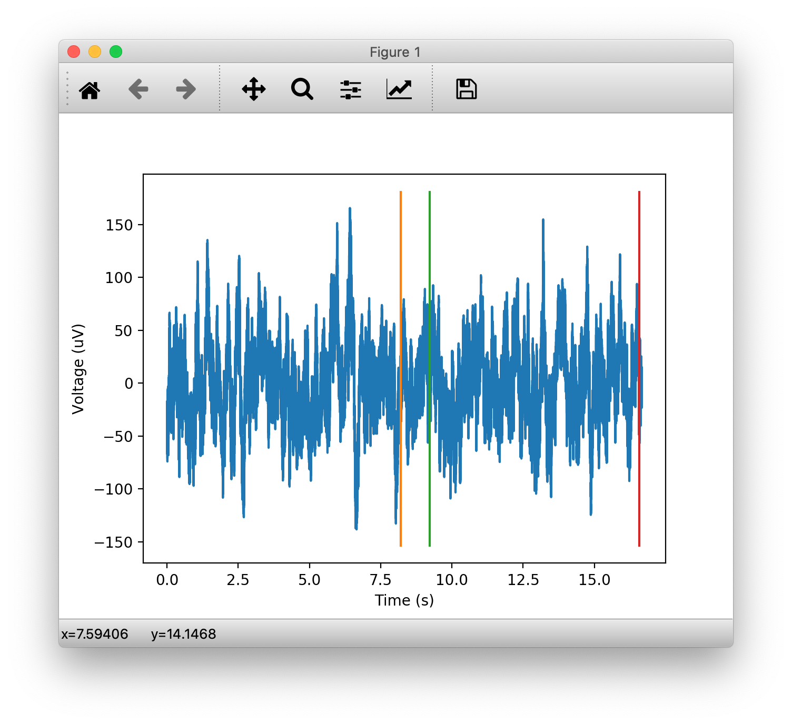

# Part 4

## 42.
We will now look at the data files created by the Ripple neural amplifier.
Change directory to the session directory `session01`:

```shell
In[ ]: cd session01
```

## 43.
If you do a file listing, you will see:

```shell
In[ ]: ls

181105_Block1.nev   data_raw6.hkl
```

We will be using the NEV file, which contains the markers sent by Unity, and the HKL file, which contains the neural signal from one of the 110 channels recorded.

## 44.
We will start by reading the HKL file, by doing:

```shell
In[ ]: import hickle
In[ ]: data = hickle.load('data_raw6.hkl')
```

You can find out more information about the recording by doing:

```shell
In[ ]: data.shape

(164880600, 1)
```

The first number shows you the total number of data points, which was recorded at a sampling rate 30 kHz. This means that the recording duration was 91 minutes (164880600 points divided by 30,000 pts/s divided by 60 s/min).

## 45.
Next, we will read the NEV file to obtain the markers sent by Unity through the parallel port, by doing:

```shell
In[ ]: from neo.io import BlackrockIO
In[ ]: reader = BlackrockIO('181105_Block1.nev')
In[ ]: ev_rawtimes, _, ev_markers = reader.get_event_timestamps()
```

You may get a warning after executing the second command above, but it is safe to ignore it and continue.

> <p class="note"> Note
>
> If you get the following error:
>
> ```shell
> IndexError: too many indices for array: array is 1-dimensional, but 2 were indexed
> ```
> You can try changing the following line of code around Line 444 (the exact line number might vary depending on which version you have installed) in `~/miniconda/envs/aws/lib/python3.8/site-packages/neo/rawio/blackrockrawio.py` (you can find the exact path to this file on your computer by looking at the error) from:
> ```python
> mask = [ev_ids == i]
> ```
> to
> ```python
> mask = ev_ids == i
> ```
> and try again.

## 46.
Looking at ev_markers, we see the same markers that were in the Unity and Eyelink data files, starting with 84, followed by 14 (Cue Onset), 24 (Cue Offset), and 34 (Reward), except that there are zeros in between the markers. This was because the parallel port needed to be reset to zero in between markers:

```shell
In[ ]: ev_markers[0:9]

array([84,  0, 14,  0, 24,  0, 34,  0, 16], dtype=uint16)
```

## 47.
Looking at ev_rawtimes, we see the sample number that coincided with the markers:

```shell
In[ ]: ev_rawtimes[0:9]

array([183607, 183628, 245904, 245905, 276652, 276653, 497314, 497315, 557948], dtype=uint32)
```

which we can convert to timestamps by dividing by the sampling rate.

## 48.
Write a Python script to create the figure below with appropriate labels that shows the broadband data together with the markers for the first 500,000 samples. Please use vectorization techniques to draw vertical lines indicating the 3 marker times. 

> <p class="task"> Task
>
> Include the Python script and the figure it produced in your lab report.


